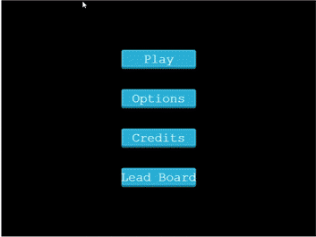

# Platform game

> This is a 5 days project, part of Microverse, as a final solo project to apply all knowledge obtained during Javascript curriculum.

## Demo down below
[Demo](https://lit-waters-36574.herokuapp.com/)

## How the game was design
The first step was to look for **How to build a phaser game**, then I looked for some tutorials about build platform games and Follow a tutorial to build a phaser template. After all this process, I finished picked the most suitable to me and try to adapt it to my game design. I also has to figure out how to add and input field inside phaser environment and also how to create a leader board as well.

## How the game was developed
This game was developed using phaser3 framework and also using webpack, babel and express to deploy to Heroku.

## Built With ✨
- JavaScript ECMA6
- Node.js v11.9.0
- webpack 4.41.2
- [phaser 3](https://phaser.io/phaser3)

To get a local copy up and running follow these simple example steps mention below.

### Prerequisites
* Node.js installed
This project is only tested with node v11.9.0

* System dependencies
Windows/ Mac

### Local Install
Clone project and run
`npm install`

After all dependencies install, run:
`npm start`

The project runs on http://localhost:8080/

### How to play
Use arrow keys to move left right and jump. The goal is to collect as many ⭐ as you can and avoid be touched by the 💣

## How to contribute and partipate
Fork this repo and submit a PR for review and potential merge to main branch. Feel free to leave feedback :smile:

## Authors

👨‍💻 **Christian Salazar**

- Github: [@grifo89](https://github.com/grifo89)
